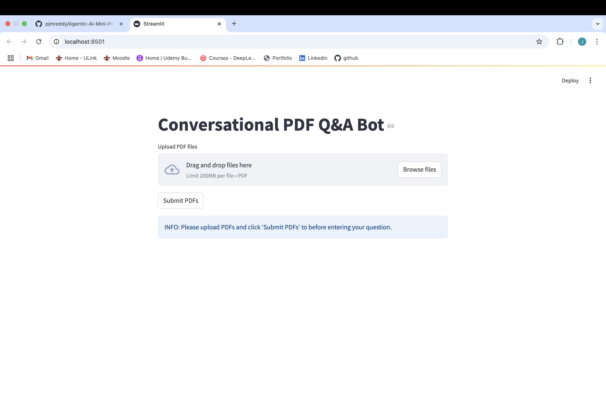
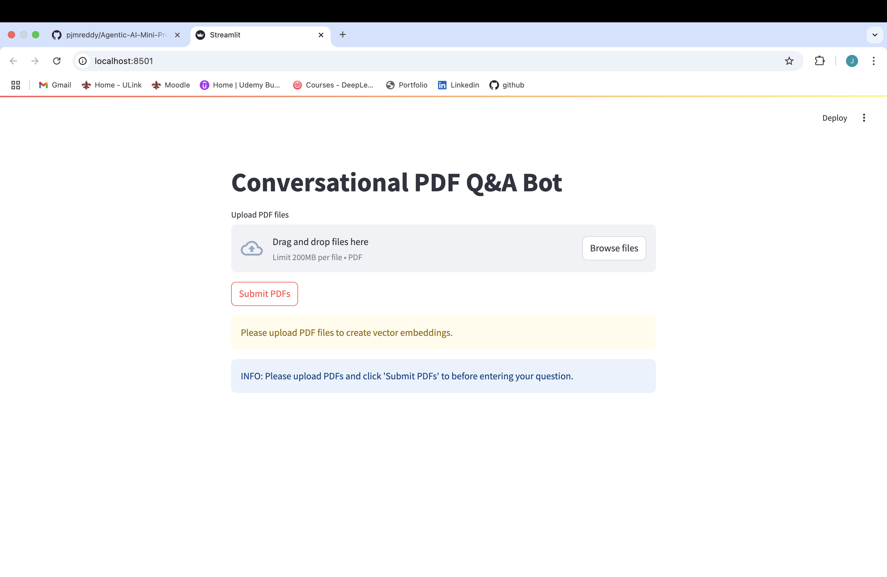
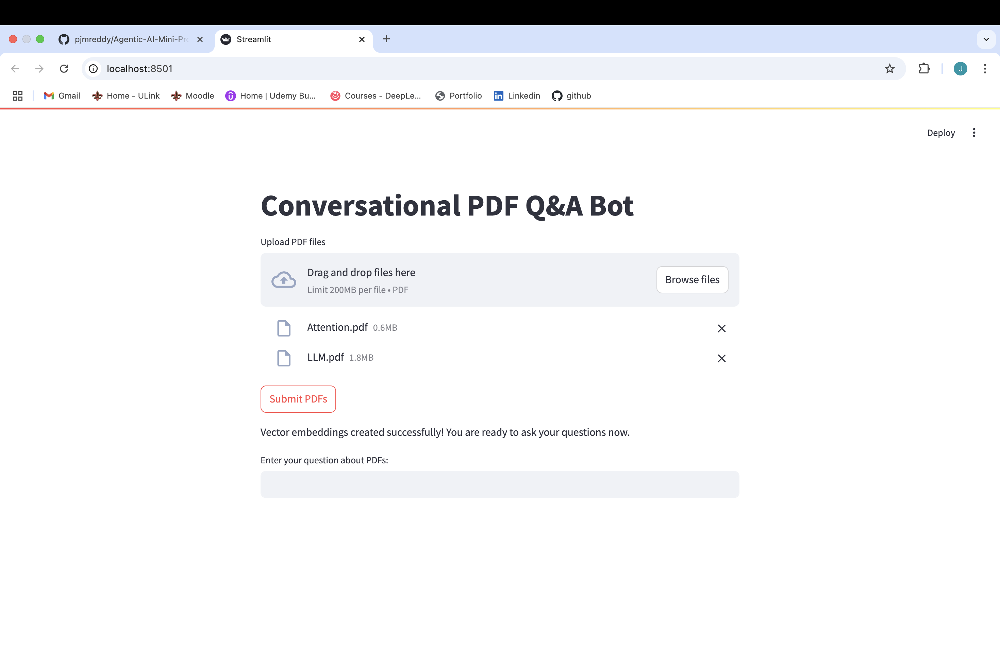
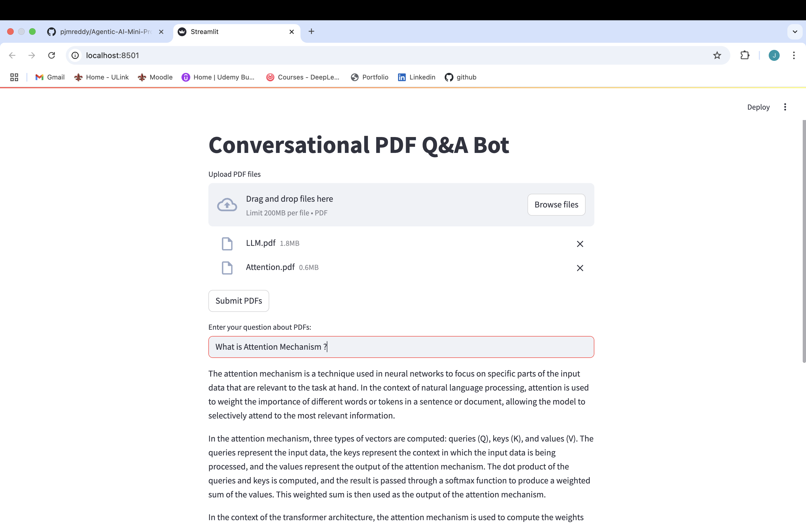

<h1 align="center"><strong>Conversational RAG: PDF Q&A ChatBot</strong></h1>

This application is a conversational PDF Q&A bot that uses Retrieval-Augmented Generation (RAG) with the GROQ API and LangChain to answer questions about uploaded PDF documents. The bot leverages vector embeddings to provide accurate and contextually relevant answers to user queries.

## Features

- Upload multiple PDF documents
- Process and create vector embeddings from PDF content
- Ask questions about the content of the uploaded PDFs
- Get AI-generated answers based on the document context
- Response time tracking

## Technology Stack

- **LLM**: GROQ API with Llama3-8b-8192 model
- **Embeddings**: HuggingFace's all-MiniLM-L6-v2 model
- **Vector Store**: FAISS (Facebook AI Similarity Search)
- **Document Processing**: LangChain's document loaders and text splitters
- **UI**: Streamlit

## Prerequisites

- Python 3.8+
- GROQ API key
- HuggingFace token

## Installation

1. Clone the repository

2. Install the required dependencies:
   ```
   pip install -r requirements.txt
   ```

3. Create a `.env` file in the project root with your API keys:
   ```
   GROQ_API_KEY=your_groq_api_key_here
   HF_TOKEN=your_huggingface_token_here
   ```

## Usage

1. Start the application:
   ```
   streamlit run RAG_PDFbot_with_GROQAPI.py
   ```

2. The application will open in your default web browser.

### User Interface Flow

#### Landing Page



The landing page displays the title of the application and provides a file uploader for PDF documents.

#### File Upload Failed



If you attempt to submit without uploading any PDF files, the application will display a warning message.

#### Vector Embeddings Creation



After uploading PDF files and clicking the "Submit PDFs" button, the application processes the documents and creates vector embeddings. A success message is displayed when the embeddings are ready.

#### Question Answering



Once the vector embeddings are created, you can enter questions about the content of the uploaded PDFs. The application will retrieve relevant information from the documents and provide an answer along with the response time.

## How It Works

1. **Document Processing**:
   - The application loads PDF documents using PyPDFLoader
   - Documents are split into smaller chunks using RecursiveCharacterTextSplitter
   - Text chunks are converted into vector embeddings using HuggingFace's embedding model
   - Embeddings are stored in a FAISS vector database for efficient similarity search

2. **Question Answering**:
   - When a user asks a question, the application searches for the most relevant document chunks
   - The retrieved chunks are sent as context to the GROQ LLM (Llama3-8b-8192)
   - The LLM generates an answer based on the provided context
   - The answer and response time are displayed to the user

## Code Structure

- **Environment Setup**: Loading API keys from .env file
- **LLM Initialization**: Setting up the GROQ LLM with the Llama3 model
- **Prompt Template**: Defining how to format the context and question for the LLM
- **UI Components**: Streamlit interface elements for file upload and user interaction
- **Vector Embedding Creation**: Processing PDFs and creating searchable embeddings
- **Retrieval Chain**: Connecting the vector store to the LLM for context-based answers

## Customization

You can customize the application by modifying the following parameters:

- **Chunk Size and Overlap**: Adjust the text splitting parameters for different document types
  ```python
  st.session_state.text_splitter = RecursiveCharacterTextSplitter(chunk_size=1000, chunk_overlap=200)
  ```

- **LLM Model**: Change the GROQ model to use different versions
  ```python
  llm = ChatGroq(
      groq_api_key=groq_api_key,
      model_name="Llama3-8b-8192"
  )
  ```
- **Prompt Template**: Modify the prompt to change how the LLM responds


## License

This project is open source and available under the [GNU General Public License v3.0 (GPL-3.0)](LICENSE).

## Acknowledgements

- [LangChain](https://github.com/langchain-ai/langchain) for the document processing and retrieval framework
- [GROQ](https://groq.com/) for the LLM API
- [HuggingFace](https://huggingface.co/) for the embedding models
- [FAISS](https://github.com/facebookresearch/faiss) for the vector database
- [Streamlit](https://streamlit.io/) for the user interface
